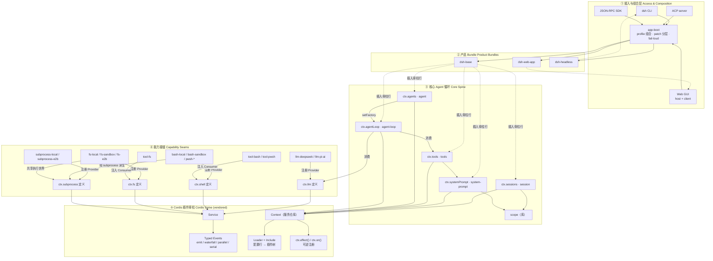
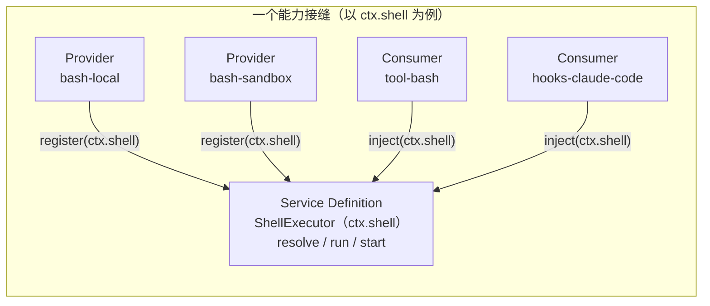
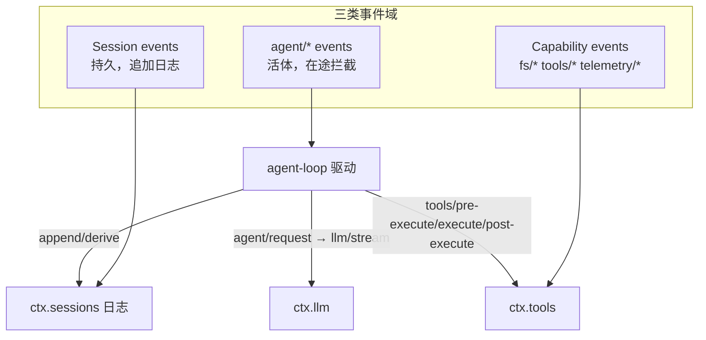

# DeepSeek Harness (dsh) 架构说明

> 本文是基于源码与仓库内权威文档交叉验证后整理的架构分析文档（中文）。
> 权威出处：`docs/architecture.md`、`docs/cordis-primer.md`、`docs/glossary.md`、生成的 `docs/capability-seams.md`，以及 `packages/core/agent`、`packages/core/tools`、`packages/core/agent-loop`、`packages/llm/llm`、`packages/shell/shell`、`packages/boot/app-boot`、`packages/bundle/*` 等源码。

## 摘要

DeepSeek Harness 是一个构建在 **vendored Cordis** 之上的插件化 Agent 运行时。它没有"特权核心"：模型适配器、工具注册表、会话日志、甚至 **Agent 循环本身**，都是挂载在共享上下文上的可替换插件。系统通过**能力接缝（Capability Seam）** 的"接口定义 / 实现 / 消费方"三角色模式解耦能力，通过**事件**（观察、拦截、策略）组织协作，通过**分层的 patch 组合**把一棵插件树装配成可运行的 `dsh`。

一句话贯穿全文：**一切皆插件；扩展 dsh 的方式是在其他插件旁再挂载一个插件，而注册本身是可撤销的 effect，随插件的卸载而回卷。**

---

## 0. 仓库目录结构（Directory Layout）

> 目录结构以当前工作树为准（顶层目录与 `packages/` 分组均实测核对）。`packages/` 采用 `<group>/<pkg>` 两层，npm 包名统一为 `@deepseek-ai/dsh-<pkg>`。

### 0.1 顶层目录

| 目录 | 主要作用 |
|---|---|
| `packages/` | 全部 `@deepseek-ai/dsh-*` 工作区，按分组组织（见 0.2） |
| `apps/` | 可执行应用入口：`cli`（`dsh` 启动器）、`web`（Vite 前端 shell 构建入口，非独立应用，靠 `dsh web` 注入 `__DSH_BOOT__`） |
| `vendor/` | vendored 框架源码：`cordis`/`loader`/`include`/`hmr`/`group`/`schemastery`/`timer`/`cosmokit`/`logger-console` |
| `docs/` | 架构、术语、子系统、生成目录（config/tool/persistence catalog、module-graph）、cookbook、postmortem |
| `examples/` | 可运行 `cordis.yml` 叶子（`acp-agent`/`headless-agent`/`jsonrpc-agent`/`web-cordis`/`web-schedule`/`mcp-memory`），加载 `packages/examples` 的 demo bundles |
| `python/` | Python SDK 与内置运行时（`deepseek-harness` 包） |
| `native/` | `@deepseek-ai/node-addon-landlock-run` 原生插件的 source of record |
| `scripts/` | 仓库门禁与生成器（doc-sync、module-graph、catalog 生成等） |
| `website/` | VitePress 文档站（`docs/` 双语源的投影） |
| `assets/` | 静态资源 |
| `patches/` | pnpm patches |
| `.agents/` | Agent 工作流、skills、Agent Notes（`notes/`） |
| `.github/` | CI / 工作流配置 |

### 0.2 `packages/` 分组（49 个 group）

**产品 API 脊柱（core）**

| 分组 | 主要作用 |
|---|---|
| `core/` | 脊柱本体：`session`、`system-prompt`、`tools`、`agent`、`agent-loop`、`scope`、`agent-default-model`、`agent-tool-presentation` |

**模型与类型系统**

| 分组 | 主要作用 |
|---|---|
| `llm/` | LLM 能力族：抽象 `ctx.llm` Service + `llm-deepseek`/`llm-pi-ai` 适配器 + `token-meter` + `llm-retry` |
| `typert/` | 类型图生成、artifact 加载、运行时注册表 |
| `api/` | Remote BFF 装配与 Typert RPC 网关 |

**执行与能力接缝（capability seams）**

| 分组 | 主要作用 |
|---|---|
| `shell/` | bash 能力：`ctx.shell` executor seam、本地/sandbox impl、`tool-bash`/`tool-pwsh` |
| `subprocess/` | `ctx.subprocess` 子进程接缝 + 本地进程树 provider |
| `terminal/` | 持久 PTY 会话：`ctx.terminals` + `tool-terminal` |
| `fs/` | 文件系统接缝 `ctx.fs` + 策略 + `tool-fs` |
| `lsp/` | language-server 能力：seam + stdio provider + `lsp` 工具 |
| `sandbox/` | 进程隔离 seam：bwrap/Landlock/Seatbelt/Windows ACL 后端 |
| `code-runtime/` | 代码执行 seam + worker-thread provider + Code Mode Consumer |
| `e2b/` | E2B POC：远程沙箱 + fs/subprocess 适配器 |
| `web/` | web 能力：`ctx.web` seam + search/fetch providers + `tool-web` |
| `mcp/` | MCP 客户端（MCP-sourced tools 经 `ctx.tools.register()` 接入） |
| `skill/` | skill 能力：`ctx.skills` 注册表 + 本地 filesystem provider + catalog/loader 工具 |
| `subagent/` | 子代理能力：`ctx.subagents` + spawn/fork/acp/codex/claude-code/sdk providers + 委托工具 |
| `workflow/` | 工作流能力 + worker-thread 引擎 + `workflow`/`ralph` 工具 |
| `jobs/` | 后台任务运行时 `ctx.jobs` + `job_*` 控制工具 |
| `compaction/` | 上下文压缩能力 + basic provider |
| `spill/` | 超大工具结果溢出存储 seam + 策略 |
| `schedule/` | 会话内定时 follow-up |

**会话与持久化数据面**

| 分组 | 主要作用 |
|---|---|
| `session/` | 持久会话数据面：persistence seam + JSONL/SQLite 后端、projection、log-backed 标题、telemetry |
| `session-query/` | 会话检索：corpus、bounded reads、lineage、事件关系、SQLite FTS |
| `storage/` | 非会话存储 hub + json/sqlite 后端 + domain form |
| `attachment/` | 持久附件身份、校验、本地 content-addressed 存储 |
| `workspace/` | workspace 实体 |
| `identity/` | 匿名身份 |

**产品功能域**

| 分组 | 主要作用 |
|---|---|
| `todo/` | `todo_write` 工具 |
| `plan/` | plan 协作状态（登录态） |
| `goal/` | 同会话 goal 域 + round-driver + `/goal` 命令 + `tool-goal` |
| `guard/` | 循环卫生 + 工具超时策略 |
| `context/` | 模型可见请求上下文（workspace 指令、时间上下文） |
| `preset/` | 每会话 agent 组合（`ctx.agentPresets`） |
| `feedback/` | 人类反馈 |

**用户交互 / 设置 / 凭据**

| 分组 | 主要作用 |
|---|---|
| `interaction/` | 审批/交互能力、权限预设、命令、ask-user 工具 |
| `settings/` | 用户设置 seam + file provider |
| `credentials/` | 凭据引用 seam + env-over-`.env` provider |

**扩展与钩子**

| 分组 | 主要作用 |
|---|---|
| `extensions/` | agent 运行时自修改：插件/服务 inspect、模型写的插件 mount/unmount（`tool-cordis`） |
| `hooks/` | Claude Code/Codex hook 桥 + 共享 wire 协议库 |

**接入面 / 传输 / 宿主**

| 分组 | 主要作用 |
|---|---|
| `acp/` | 自动化-only Agent Client Protocol server |
| `sdk/` | JSON-RPC 协议、server、TypeScript client |
| `boot/` | 共享 app-bin 粘合（`app-boot`、`cmdline`） |
| `host/` | Web-GUI host 半：API 网关（apiproxy）、HTTP 路由、前端静态 |
| `client/` | Web-GUI browser 半：shell、wire、对象服务、slots、`ui-*` 插件 |

**分发与支撑**

| 分组 | 主要作用 |
|---|---|
| `bundle/` | 可安装 `dsh --profile` patch 层（`base`/`web-app`/`headless`） |
| `examples/` | demo bundles（`agent-spine-demo` + CLI/ACP/JSON-RPC bins） |
| `test-support/` | 测试基础设施（testkits、invariants、replay、Loader smokes） |
| `runtime-diagnostics/` | 运行时诊断：`invariants`（包级不变量注册表） |
| `util/` | 零依赖工具（`Branded<B>`、Harness home/路径、timeout、retention） |

> 分组职责的权威出处是各 group 的 `README.md`（"Group READMEs own package/ctx-key maps"）；`packages/README.md` 有完整分组表，`docs/module-graph.md`（`pnpm run gen-module-graph` 生成）给出包级依赖图。

---

## 1. 五层架构全景

dsh 从下到上可切分为五层。每层只依赖其下层提供的抽象，不依赖下层的具体实现。

| 层 | 名称 | 职责 | 代表包 |
|---|---|---|---|
| ① | 接入与组合层 | 把插件树装配起来，并暴露为不同交互面 | `boot/app-boot`、`boot/cmdline`、`sdk`、`acp`、`host`/`client` |
| ② | 产品 Bundle | 可安装的 patch 层，声明"默认产品长什么样" | `bundle/base`、`bundle/web-app`、`bundle/headless` |
| ③ | 核心 Agent 循环 | 产品 API 脊柱：会话、提示词、工具、Agent、驱动循环 | `core/session`、`core/system-prompt`、`core/tools`、`core/agent`、`core/agent-loop` |
| ④ | 能力接缝 | 可替换能力：Definition / Provider / Consumer | `llm`、`shell`、`fs`、`subprocess`、`terminal`、`sandbox`、`web`、`subagent`… |
| ⑤ | Cordis 插件脊柱 | 服务仓库、类型化事件、可逆 effect、配置加载器 | `vendor/cordis`、`vendor/loader`、`vendor/include` |

### ① 接入与组合层（Access & Composition）

一个运行中的 `dsh` 是**在 boot 时由有序的层组装出来的一棵插件树**。`app-boot` 负责：

- 加载分层 `.env`（继承环境 → 调用目录 → Harness home），并拒绝在 `.env` 中设置 `PATH`/`DSH_*` 等"只能由启动环境决定"的引导变量。
- 安装 fail-loud 守卫：任何插件初始化失败或未能激活，都带原始栈失败退出，绝不静默跳过。
- 驱动 Cordis `Loader`，把 `cordis.yml` 的配置行（Entry）解析并挂载成插件实例，直到整棵树稳定。
- 组合 **patch 层**，顺序为：profile 列出的每个 bundle → profile 的 `cordis.patch.yml` → home 级 `cordis.patch.yml` → `--patch` 覆盖层。patch 按行 `id` 定位并**整体替换**该行 config，或插入新行。

交互面都只是同一棵树的**不同投影**：`dsh` CLI、Web GUI（`host` 半 + `client` 半）、`acp` 自动化服务器、`sdk` 的 JSON-RPC。`dsh --profile web --dump-config` 可打印本机实际 boot 的树，任何一行都能被用户自己的 patch 替换。

### ② 产品 Bundle

**Bundle** 是 Cordis 配置行及其挂载代码的**分发格式**——`package.json` 中以 `"dsh": { "bundle": { "patch": "./cordis.patch.yml" } }` 声明，实质内容就是一份 patch 列表（部分 bundle 还附带自己 patch 挂载的 glue 插件）。

- **`dsh-base`**：每个 profile 的第一层，插入模型适配器、工具、持久化、沙箱/审批策略、设置/凭据、遥测等基础行；按平台用 `disabled: !!js process.platform === 'win32'` 切换 bash/pwsh 栈。
- **`dsh-web-app`**：在 base 之上加浏览器面——HTTP 服务器、API 网关、前端静态服务、客户端插件热更新链。
- **`dsh-headless`**：在 base 之上加一次性 runner，无任何 Host/端口——读任务、创建一个 Agent、提交消息、等待静默后退出。

### ③ 核心 Agent 循环（产品 API 脊柱）

六个包构成一条循环（详见 §7）：

- `session`（`ctx.sessions`）——**append-only 的 `SessionEvent` 日志** + 内存存储，唯一事实源。
- `system-prompt`（`ctx.systemPrompt`）——提示词 section 与工具 schema 的装配器。
- `tools`（`ctx.tools`）——作用域化的工具注册表 + 受守卫的执行流水线。
- `agent`（`ctx.agents`）——`Agent` 接口、活体注册表、工厂接缝、进程内发起者作用域。
- `agent-loop`（`ctx.agentLoop`）——实现上述接口的**默认驱动**。
- `scope`——无 `ctx` 键的库，提供 `createScope`/`scopeOf`/`scopeTarget`，是各注册表实现"每 Agent 作用域"的基元。

### ④ 能力接缝（Capability Seam）

可替换能力，见 §3。典型如 `llm`、`shell`、`fs`、`subprocess`、`terminal`、`lsp`、`sandbox`、`web`、`skill`、`subagent`、`workflow`、`compaction`、`spill`、`sessionPersistence`、`settings`、`credentials` 等。

### ⑤ Cordis 插件脊柱

vendored 的 Cordis 是唯一"特权"框架层，但**它本身不携带任何产品语义**——只提供服务、事件与 effect 的机制。详见 §2。

---

## 2. 一切皆插件（Everything is a Plugin）

Cordis 的核心心智模型只有五条（见 `docs/cordis-primer.md`）：

1. **插件**是实现 `Service` 的对象——可以是一个带 `inject`/`apply(ctx)` 的函数插件，或一个 `Service` 子类，其生命周期由 Cordis 挂载进当前上下文。
2. **上下文（Context）是服务的仓库**：服务认领一个稳定的 `ctx.<key>`（如 `ctx.tools`、`ctx.llm`、`ctx.sessions`），其他插件**通过 key 查找服务，而非 import 具体实现**。
3. 用 `inject` 声明服务依赖：声明了所需服务的插件会等到那些服务存在，因此**加载顺序由服务依赖表达**，而非手工 boot 顺序。
4. **类型化事件**用于通信：服务通过 TypeScript declaration merging 声明事件名，再以 `emit`/`waterfall`/`parallel`/`serial` 分发。
5. **注册是可逆 effect**：提示词 section、工具 schema、适配器、provider、监听器都经 `ctx.effect()` / `ctx.on()` 安装，reload 与 teardown 时按序回卷。

落实到"产品的一部分全部是可替换插件"：

| 产品构件 | 插件挂载方式 | 替换点 |
|---|---|---|
| **模型适配器** | `llm-deepseek`/`llm-pi-ai` 实现抽象 `LlmAdapter`，调用 `ctx.llm.registerAdapter(providers, adapter)` | 换一个 adapter 插件即换模型后端 |
| **工具注册表** | `tools` 本身是 `Service` 子类，持有 `ctx.tools`；每个工具经 `ctx.tools.register()` 挂载 | 工具即插件，注册返回 disposer |
| **会话日志** | `session` 是 `Service` 子类，持有 `ctx.sessions` | 持久化另有 `sessionPersistence` 接缝 |
| **Agent 循环本身** | `agent-loop` 是一个插件，构造时调用 `ctx.agents.setFactory()` 注册 `AgentFactory`；消费者一律依赖 `dsh-agent`，**从不依赖 `dsh-agent-loop`** | 换掉 `agent-loop` 插件即换掉驱动 |

关键证据：`packages/core/agent` 的 `AgentRegistry` 只持有一个 `factory` 槽位，`create`/`resume` 全部委托给"无论哪个插件实现的 `AgentFactory`"（源码注释明确："Agent creation is provided by whichever plugin implements the `AgentFactory` (`@deepseek-ai/dsh-agent-loop`)"）。这正是"没有需要 patch 的特权核心，只有并排挂载的插件"的结构化表达。

---

## 3. 能力接缝（Capability Seam）：Definition / Provider / Consumer

一个 **seam**（接缝）是具备**三个角色**的可替换能力：

- **Service Definition**：声明接口的 Cordis `Service`——占有其 `ctx.<key>` 与词汇类型。它是**抽象类**（如 `ShellExecutor`）或具体注册表（如 `WebRuntime`），**从不是 TypeScript `interface`**。
- **Service Provider**：实现该定义、注册到 `ctx.<key>`。
- **Consumer**：`inject` 该服务并消费它——通常是面向模型的工具。

三者缺一不可；只有一个角色不构成接缝。角色通常在各自独立演化时分属不同包，但当一个包内多个角色同属一个关注点时也可合并（`dsh-llm` 同时拥有 Definition 与 Consumer）。

### 3.1 范式案例：`ctx.shell`

```
Service Definition  dsh-shell      abstract class ShellExecutor（resolve/run/start）
Service Provider    dsh-bash-local / dsh-bash-sandbox / dsh-pwsh-local / dsh-pwsh-sandbox
Consumer            dsh-tool-bash / dsh-tool-pwsh（面向模型）+ hooks-claude-code / hooks-codex（桥）
```

`ShellExecutor`（`packages/shell/shell/src/index.ts`）声明了 `ctx.shell`，抽象出 `resolve(request): Spec`（把请求物化为全量 spec，避免在 `run()` 里藏 `?? default`）与 `run`/`start`。任何 executor 替换都无需改动 tool-bash 或 hook 桥——它们只依赖抽象类。

### 3.2 为什么一个 Provider 替换能改变整个产品

接缝的威力在**共享执行世界**上最直观：

> 文件系统与子进程 provider 共享同一个执行世界——把 `ctx.fs` 与 `ctx.subprocess` 同时指向远程沙箱，Bash、PTY、LSP 会**一起**迁移，而无需为每个能力写 provider fork。

`ctx.subprocess` 的 Provider 表显示：`bash-local`、`terminal-bash`、`lsp-stdio`、以及 ACP/Codex/Claude Code 的出进程 subagent 后端，全部通过 `ctx.subprocess` 派生进程。`ctx.fs` 的 Provider（`fs-local`/`fs-sandbox`/`fs-e2b`）与 `ctx.subprocess` 的 Provider（`subprocess-local`/`subprocess-e2b`）由 `e2b` 共享一个 E2B SDK 句柄，构成同一远程 Linux 运行时。

`subagent` 接缝同样在一个接口后容纳从"全新子 Agent"到"另一产品的委托 turn"等差异极大的实现。

### 3.3 三个代表性接缝一览

| `ctx` 键 | Definition | Provider(s) | Consumer(s) |
|---|---|---|---|
| `ctx.llm` | `dsh-llm`（`LlmAdapter` + `LlmRuntime` 注册表） | `llm-deepseek`、`llm-pi-ai`、（`llm-replay`） | `agent-loop`、`compaction-basic` |
| `ctx.shell` | `dsh-shell`（`ShellExecutor`） | `bash-local`、`bash-sandbox`、`pwsh-local` | `tool-bash`、`tool-pwsh`、hook 桥 |
| `ctx.fs` | `dsh-fs` | `fs-local`、`fs-sandbox`、`fs-e2b` | `tool-fs`（companion：`fs-observation-policy` 经 `fs/*` 事件门） |
| `ctx.subprocess` | `dsh-subprocess` | `subprocess-local`、`subprocess-e2b` | bash 执行器、PTY、LSP host、出进程 subagent |
| `ctx.terminals` | `dsh-terminal` | `terminal-bash` | `tool-terminal` |
| `ctx.sandbox` | `dsh-sandbox` | `sandbox-local` | `bash-sandbox`、`terminal-bash` |
| `ctx.codeRuntime` | `dsh-code-runtime` | `code-runtime-worker` | `tools`（Code Mode） |
| `ctx.subagents` | `dsh-subagent` | `spawn/fork-in-process`、`acp`、`codex`、`claude-code`、`dsh-sdk` | `tool-subagent`、`tool-ralph` |
| `ctx.web` | `dsh-web` | `web-search-*`、`web-fetch-http` | `tool-web` |
| `ctx.sessionPersistence` | `dsh-session-persistence` | `-jsonl`、`-sqlite` | `agent-loop`、`session-query` 等 |

完整清单见生成文档 [`docs/capability-seams.md`](docs/capability-seams.md)，其中包含一张自动生成的 `package → ctx 服务` 依赖图。

---

## 4. 核心模块与上下文（Context）

### 4.1 脊柱的六个 `ctx` 模块

| `ctx` 键 | 包 | 职责 |
|---|---|---|
| `ctx.sessions` | `core/session` | append-only `SessionEvent` 日志 + 内存存储；`deriveMessages()` 从日志投影模型历史；fork/resume/transcript/telemetry/persistence 全部由此流派生 |
| `ctx.systemPrompt` | `core/system-prompt` | 收集每个 step 的提示词 section 与工具 schema |
| `ctx.tools` | `core/tools` | 作用域化工具注册表 + 受守卫执行流水线（pre-execute → guard → execute → post-execute → result），并持有 Code Mode 传输 |
| `ctx.agents` | `core/agent` | 活体 Agent 注册表、create/resume 工厂接缝、进程内发起者（initiator）传播 |
| `ctx.agentLoop` | `core/agent-loop` | 具体驱动（工厂 + `ReactLoopAgent` + 并行调度 + 有序 teardown） |
| （库）`scope` | `core/scope` | `createScope`/`scopeOf`/`scopeTarget`，注册表据此实现每 Agent 作用域与作用域过滤分发 |

### 4.2 其他关键 `ctx` 模块（节选）

- **`ctx.llm`** — 适配器注册表 + 可被 `llm/stream` waterfall 拦截的流式调用 API（`LlmRuntime.stream` 内部就是 `ctx.waterfall(this, 'llm/stream', options, next)`）。
- **`ctx.shell` / `ctx.fs` / `ctx.subprocess` / `ctx.terminals` / `ctx.sandbox` / `ctx.sandboxPolicy`** — 执行与文件访问能力（见 §3）。
- **`ctx.commands`** — 人类命令注册表，`/goal` 等不经模型 turn 直接分发。
- **`ctx.jobs`** — 后台任务注册表；`job_*` 工具读取/停止。
- **`ctx.goals`** — 同会话目标域（`active/paused/blocked/complete` 分阶段、目标轮次上限）。
- **`ctx.planMode`** — plan 协作状态（登录态）。
- **`ctx.settings` / `ctx.credentials`** — 用户设置接缝、凭据引用接缝（env-over-`.env` provider）。
- **`ctx.approval` / `ctx.userQuestions`** — 审批/人机问答接缝。
- **`ctx.agentPresets`** — 每会话的 Agent 组合，从 preset `cordis.yml` 挂载，`isolate` realm 内发布服务。
- **`ctx.invariants` / `ctx.typert`** — 包级运行时不变量注册表、运行时类型注册表。
- **`ctx.storage` / `ctx.sessionQuery` / `ctx.sessionTitle`** — 非会话存储、会话检索、日志支持的标题。

### 4.3 共享上下文如何协作

- **按 key 查找而非 import**：插件通过 `ctx.<key>`（声明注入）或 `ctx.get(name)`（可选服务）取得协作者。可选服务用 `ctx.get`，避免把整条插件链绑在"服务必须存在"上（如 `ctx.get('codeRuntime')` 在 `native` 模式下允许不存在）。
- **作用域上下文 `agent.ctx`**：每个 Agent 拥有一个作用域化的 Context。经它注册的贡献（工具、提示词 section、变量、限制、监听器）对该 Agent 局部可见、随其 disposal 回卷，并在该 Agent 的作用域过滤分发中参与。
- **发起者作用域**：`ctx.agents.withInitiator(agent, fn)` 经 `AsyncLocalStorage` 在进程内沿异步链携带"发起者 Agent"（用于日志/追踪/归因），但它只是同进程因果归因，**不是活跃度证明或授权**。
- **shadowing**：作用域化注册按"最具体者胜"遮蔽同名全局项——这是"每 Agent persona / 每 Agent 工具变体"机制。

---

## 5. 事件系统与分发

事件是**扩展点**。选择正确的事件域是做大多数改动的第一决策。

- **Session events**（`turn/*`、`step/*`、`user/message`、`assistant/*`、`tool/*`）——持久事实，追加进日志并经 `session/event` 广播。事实需要跨 reload 存活时用它。
- **Agent events**（`agent/*`）——携带活体 `Agent` 的飞行中事件：inbox、step、status、request、validation、continuation。观察或拦截在途工作时用它。
- **Capability events**（`fs/*`、`tools/*`、`telemetry/*`）——把策略与适配器挂到接缝上，而**不 import 循环**。

四种分发模式（模式的语义是事件公共契约的一部分）：

| 模式 | 分发顺序 | 语义 | 返回值 |
|---|---|---|---|
| `emit` | 注册顺序 | 观察型广播 | 无 |
| `waterfall` | 注册顺序 | 围绕式中件；`next()` 委托、不调用即短路 | 有 |
| `parallel` | 并发 | 全部监听器并行、等待完成 | 无 |
| `serial` | 注册顺序 | 串行、等待、可短路 | 有 |

**waterfall 语义**（关键约定）：监听器收到 `(...args, next)`；调用 `next()` 把（可能被包装的）结果委托给下一服务；不调用 `next()` 即短路。值经 `next()` 的返回值向上传播。**协作型监听器必须调用 `next()`**——`agent/pre-step`、`agent/request`、`llm/stream`、三个 `tools/*` 事件都是 waterfall；`agent/turn-stopping` 是 serial 且无 `next()`。

---

## 6. 核心运行流程（Turn Flow）

- **step** = 一次模型请求 + 它调用的工具；**turn** = 零或多个 step，在其首个输入被认领前开启，在无欠账时关闭。
- 输入经单一 inbox 到达驱动：有的消息立即唤醒驱动；注入的上下文在 inbox 中等待，直到其他消息唤醒它。

```text
turn/start
  认领 next-step 输入 + 一条排队消息
  组装提示词 section + 工具 schema
  -> agent/pre-step            reject | enter(messages)
     拒绝，或首次 enter 改写为空 → 无 step 关闭 turn
     step/start
     把进入的消息追加为 user/message
     从日志派生模型历史
     agent/request -> llm/stream -> assistant/chunk* -> assistant/message
     tool/call* -> tools/pre-execute -> tools/execute -> tools/post-execute -> tool/result*
     step/end
     工具欠另一次请求，或 next-step 输入到达 -> 认领 -> 下一步
  -> agent/turn-stopping
turn/end
```

### 会话日志 = 唯一事实源

`Session` 是类型化 `SessionEvent` 的 **append-only 日志**；模型消息历史由 `deriveMessages()` **派生**，而非另存。原始 `assistant/chunk` 保留回放与 UI 保真。

**模型可见 ⟺ 已记录**：任何进入模型请求的内容必须能从日志重建，且有运行时 invariant 断言此规则。因此新增一个模型可见输入，就必须新增一个 session event（扩展 `SessionEventMap` 并从日志渲染）。

---

## 7. 关键类型模式（贯穿所有子系统）

- **`…Map → 派生联合` 模式**：几乎每个可扩展求和类型都用一个以判别标签为键的接口，再用 `keyof` 派生联合；插件通过 **declaration merging** 增加变体，无需改拥有包。六个规范 map：`ContentBlockMap`、`MessageSourceMap`、`FinishReasonMap`、`TurnTriggerMap`、`TurnEndReasonMap`、`SessionEventMap`。约定在判别标签上 `switch` 而非 `if` 链。
- **Branded ID**：跨包传递的 ID 是 branded（结构上仍是字符串，但类型级不可互换——`SessionId` 不能传给期待 `CallId` 的位置）。`Branded<B>` 在仅类型包 `dsh-brand` 中，零运行时成本、无 harness 依赖。核心两个 ID：`CallId`（关联工具调用与结果）、`SessionId`（活体 Agent 与持久会话共享的身份）。

---

## 8. 系统架构图（Mermaid）

### 8.1 五层架构与依赖



### 8.2 能力接缝三角色模式（细部）



### 8.3 事件分发与 turn 流（补充）



---

## 9. 设计要点小结

1. **无特权核心**：扩展 dsh 就是并排挂插件；注册是可逆 effect，卸载即回卷。
2. **能力 = 三角色接缝**：Definition（抽象 `Service` 占有 `ctx.<key>`）+ Provider + Consumer；换 provider 不改 consumer，换整个执行世界（`fs` + `subprocess` 同迁）改全部下游。
3. **循环也可换**：消费者依赖 `dsh-agent`（`AgentRegistry` + `AgentFactory` 槽位），不依赖 `dsh-agent-loop`。
4. **日志即真相**：模型可见 ⟺ 已记录；历史由日志派生，不另存。
5. **组合即配置**：profile → bundle → patch 的分层组合，任何一行都可被上层按 id 替换；`--dump-config` 可见整棵树。

## 参考文档（源码内权威出处）

- [`docs/architecture.md`](docs/architecture.md) — 架构地图（改动 `packages/` 前必读）
- [`docs/cordis-primer.md`](docs/cordis-primer.md) — Cordis 五观念与分发语义
- [`docs/glossary.md`](docs/glossary.md) — `capability-seam`、`agent-scope`、`goal`、`turn/step/round` 术语
- [`docs/capability-seams.md`](docs/capability-seams.md) — 生成的 `package → ctx 服务` 依赖图与接缝清单
- [`docs/subsystems/core.md`](docs/subsystems/core.md) — 脊柱包、`Agent` 句柄、initiator、类型模式
- 关键源码：`packages/core/agent`、`packages/core/tools`、`packages/core/agent-loop`、`packages/llm/llm`、`packages/shell/shell`、`packages/boot/app-boot`、`packages/bundle/*`
